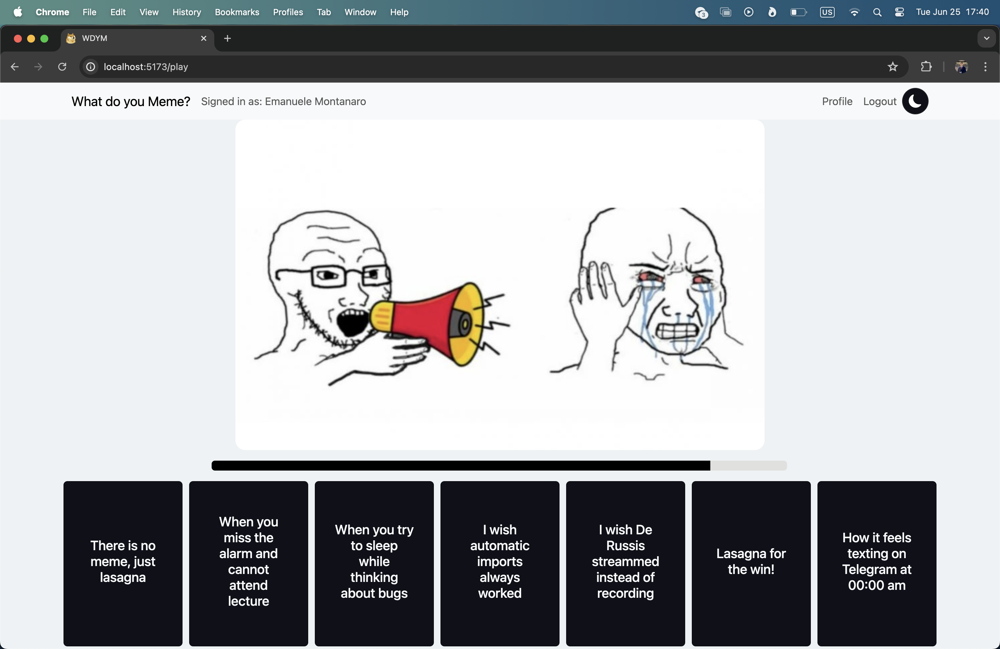
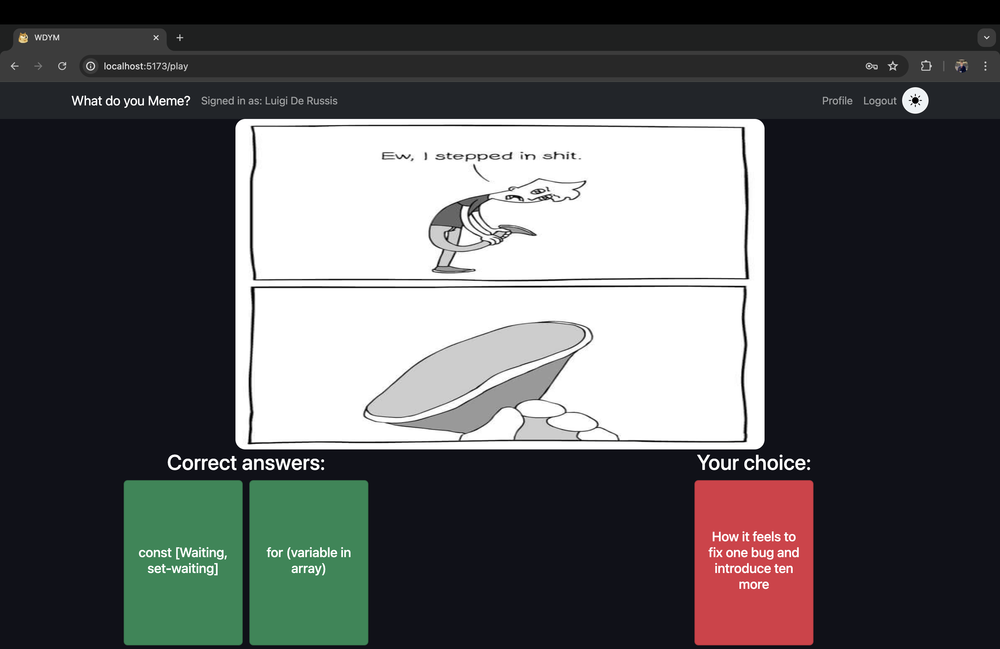

[](https://classroom.github.com/a/J0Dv0VMM)
# Esame #1 - Gioco dei Meme
## Student: s333980 Montanaro Emanuele 

## React Client Application Routes

- Route `/`: title screen page, comes with a button redirecting to /login
- Route `/home`: home page, main page for the application, shows its main functionalities and can start a game
- Route `/play`: play page, depending on login allows the user to play a single or a tiple round game by managing the round phase, its countdown and the after-round resume
- Route `/recap`: recap page to be called whenever a completed game ends or a logged in user tries to check on its previous games
- Route `/profile`: simple profile page which offers username and email of the logged in user and its games history
- Route `*`: common route for requested non-existant pages

## API Server

- GET `/api/meme`
  - Response body content:
      ```
      {
        "id": 1,
        "src": "loud-meme.jpeg",
        "answers": [
          {
            "text": "How it feels texting on Telegram at 00:00 am",
            "id": 1
          },
          {
            "text": "Props drilling finding out about context",
            "id": 2
          },
          {
            "text": "Dont CTRL+C - CTRL+V lecture exercises while doing lab",
            "id": 3
          },
          {
            "text": "const [Waiting, set-waiting]",
            "id": 4
          },
          {
            "text": "There is no meme, just lasagna",
            "id": 5
          },
          {
            "text": "Lasagna for the win!",
            "id": 6
          },
          {
            "text": "When you try to sleep while thinking about bugs",
            "id": 12
          }
        ]
      }
    ```

- GET `/api/memes`
  - Response body content:
      ```
      [
        {
          "id": 1,
          "src": "loud-meme.jpeg",
          "answers": [
            {
              "text": "How it feels texting on Telegram at 00:00 am",
              "id": 1
            },
            {
              "text": "Props drilling finding out about context",
              "id": 2
            },
            {
              "text": "Dont CTRL+C - CTRL+V lecture exercises while doing lab",
              "id": 3
            },
            {
              "text": "const [Waiting, set-waiting]",
              "id": 4
            },
            {
              "text": "There is no meme, just lasagna",
              "id": 5
            },
            {
              "text": "Lasagna for the win!",
              "id": 6
            },
            {
              "text": "When you try to sleep while thinking about bugs",
              "id": 12
            }
          ]
        },
        {
          "id": 2,
          "src": "angry-pakistani-meme.jpeg",
          "answers": [
            {
              "text": "How it feels texting on Telegram at 00:00 am",
              "id": 1
            },
            {
              "text": "Props drilling finding out about context",
              "id": 2
            },
            {
              "text": "Dont CTRL+C - CTRL+V lecture exercises while doing lab",
              "id": 3
            },
            {
              "text": "const [Waiting, set-waiting]",
              "id": 4
            },
            {
              "text": "There is no meme, just lasagna",
              "id": 5
            },
            {
              "text": "Lasagna for the win!",
              "id": 6
            },
            {
              "text": "HTML when React walks in",
              "id": 11
            }
          ]
        },
        {
          "id": 3,
          "src": "yeet-the-child-meme.jpeg",
          "answers": [
            {
              "text": "How it feels texting on Telegram at 00:00 am",
              "id": 1
            },
            {
              "text": "Props drilling finding out about context",
              "id": 2
            },
            {
              "text": "Dont CTRL+C - CTRL+V lecture exercises while doing lab",
              "id": 3
            },
            {
              "text": "const [Waiting, set-waiting]",
              "id": 4
            },
            {
              "text": "There is no meme, just lasagna",
              "id": 5
            },
            {
              "text": "Lasagna for the win!",
              "id": 6
            },
            {
              "text": "for (variable in array)",
              "id": 13
            }
          ]
        }
      ]
    ```
- GET `/api/meme/:id`
  - Request parameters: *id* of a meme
  - Response body content:
    ```
    [
      {
        "id": 1,
        "text": "How it feels texting on Telegram at 00:00 am"
      },
      {
        "id": 12,
        "text": "When you try to sleep while thinking about bugs"
      }
    ]
    ```


- POST `/api/history`
  - Request body content:
    ```
    {
      "userId": 1,
      "date": "2024-06-28",
      "hour": "14:02",
      "src1": "loud-meme.jpeg",
      "text1": "How it feels texting on Telegram at 00:00 am",
      "value1": "true",
      "src2": "angry-pakistani-meme.jpeg",
      "text2": "Props drilling finding out about context",
      "value2": "true",
      "src3": "yeet-the-child-meme.jpeg",
      "text3": "const [Waiting, set-waiting]",
      "value3": "true"
    }
    ```
- GET `/api/history/:id`
  - Request parameters: *id* of the current logged in user
  - Response body content:
    ```
    {
      "date": "2024-06-28",
      "hour": "14:02",
      "src1": "loud-meme.jpeg",
      "text1": "How it feels texting on Telegram at 00:00 am",
      "value1": "true",
      "src2": "angry-pakistani-meme.jpeg",
      "text2": "Props drilling finding out about context",
      "value2": "true",
      "src3": "yeet-the-child-meme.jpeg",
      "text3": "const [Waiting, set-waiting]",
      "value3": "true"
    }
    ```
  - POST `/api/sessions`
    - Request body content:
    ```
    {
      "username": "u1@p.it",
      "password": "pwd"
    }
    ```
    - Response body content
    ```
    {
      "id": 1,
      "name": "Emanuele Montanaro",
      "username": "u1@p.it"
    }
    ```
- GET `/api/sessions/current`
  - Response body content
    ```
    {
      "id": 1,
      "name": "Emanuele Montanaro",
      "username": "u1@p.it"
    }
    ```
- DELETE `api/sessions/current`

## Database Tables

- Table `users` - contains id name email password salt
- Table `captions` - contains id text meme1 meme2 meme3
- Table `templates` - contains id src
- Table `history` - contains id userId date hour src1 src2 src3 text1 text2 text3 value1 value2 value3 score

## Main React Components

- `Navbar` (in `NavHeader.jsx`): depending on login state shows the option to log in or useful user-related buttons for profile page and log out, furthermore includes the theme-switch button
- `SlideshowComponent` (in `HomePageComponents.jsx`): carousel of example memes with captions to show the user all possibilities offered by the application
- `SlideImage` (in `ImageComponents.jsx`): offers a quick styling of a given image and its path, depending on the selected option (component where needed)
- `ProgressBar` (in `PlayComponents.jsx`): makes the timer state visible through a decreasing bar
- `AnswerCard` (in `PlayComponents.jsx`): shows a clickable card for a given possible answer, which adds the answer to the recap state
- `AnonymousPlay` and `LoggedPlay` (in `PlayComponents.jsx`): both combine the three previous components to allow the user to play respectively a single or a three rounds game
- `RoundRow` (in `RecapComponents.jsx`): for the given round shows the template, the chosen answer and the respective points for it

## Screenshot






## Users Credentials

- username: u1@p.it, password: pwd
- username: u2@p.it, password: pwd
